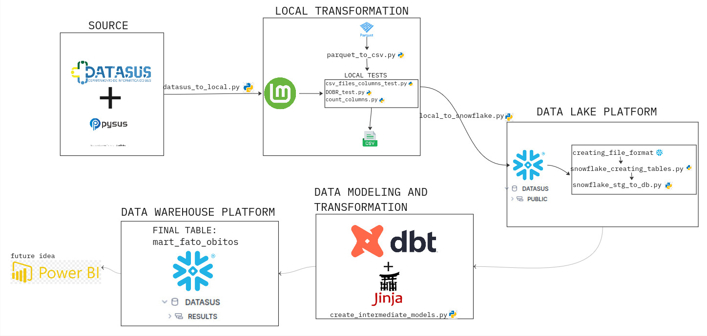
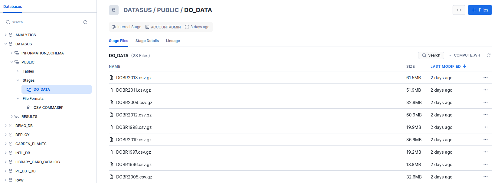
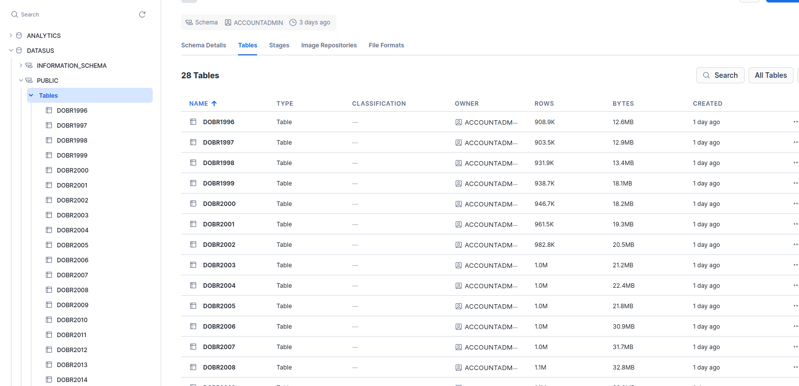
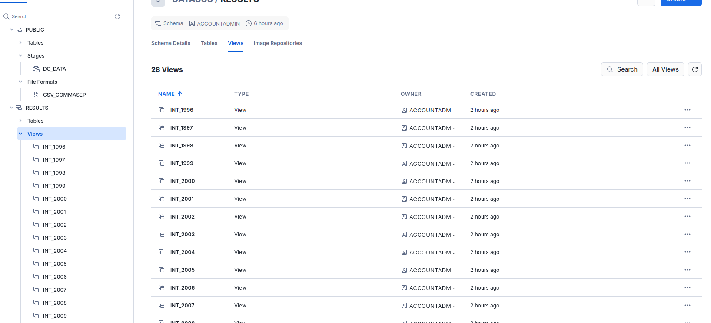
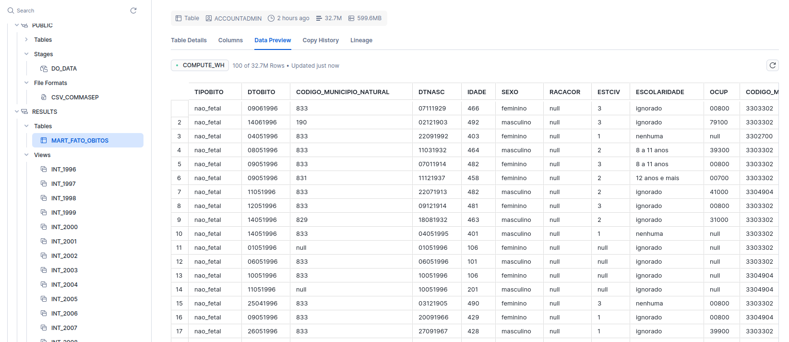

# Projeto Final do Bootcamp da Triggo.ai

## 🚀 Sobre o Projeto
Este é o **projeto final do Bootcamp da Triggo.ai**, desenvolvido para aplicar conhecimentos de **Python, SQL, ETL, Data Analysis e boas práticas de desenvolvimento de software**.  
O objetivo é construir um **pipeline de dados completo**.

[Clique aqui para acessar o pitch](https://youtu.be/XZ9DrtrXVCQ)
---

## Observação
Minhas credenciais do snowflake estão disponiveis dentro dos scripts python caso você queira verificar se o dados realmente foram transferidos.
Mesmo assim deixarei aqui alguns prints de comprovação.

## Como Rodar O Projeto
- Na pasta home do seu computador um diretorio .dbt deve ser criado e dentro dessa pasta crie um "profiles.yml"
- As dependencias disponiveis dentro de "environment.yml" devem ser instaladas dentro de um virtual environment (nesse projeto o conda foi utilizado)
- Ao instalar as dependencias relacionadas ao dbt copie e cole o texto de "profiles.txt" do "profiles.yml" no .dbt
- No terminal rode o comando "dbt debug" para testar a conexão 
- Com todo o ambiente configurado execute os scripts python na seguinte ordem
    1 - datasus_to_local.py
    2 - parquet_to_csv.py
    Antes de seguir os próximos passo apague todas as tabelas e views do database do snowflake "DATASUS" para evitar a duplicação dos arquivos
    3 - local_to_snowflake.py
    4 - snowflake_creating_tables.py
    5 - snowflake_stg_to_db.py
- Assim rode no terminal "dbt run" para trasformar os dados e envia-los para o data warehouse